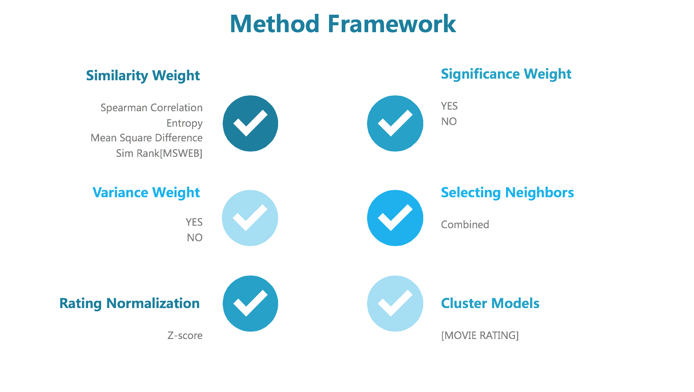

# Project 4: Collaborative Filtering

### [Project Description](doc/project4_desc.md)

Term: Fall 2017

+ Team # 8
+ Projec title: Collaborative Filtering

+ Team members
	+ Chenyun Wu
	+ Sihui Shao
	+ Sijian Xuan
	+ Yajie Guo
	+ Yiran Li
	
+ Project summary: 
In this project, we implemented collaborative filtering to make automatic predictions (filtering) about the interests of a user by collecting preferences or taste information from many users (collaborating). We also evaluated and compared a pair of algorithms for collaborative filtering. Firstly, spearman correlation, entropy, mean-squared-difference and simrank were used to get the similarity matrix, at the same time, we added significance weighting or variance weighting to similarity. Secondly, neighbors were selected by combining weighting threshold and best-n-estimator. Once the neighborhood has been selected, the ratings from those neighbors are combined to compute a prediction, after possibly scaling the ratings to a common distribution. Besides, we also tried cluster models to conduct the similar process. For evaluation part, we used ranked scoring for the first data set, while mean absolute error(MAE) was used for the movie data set.



+ Result:
Spearman Correlation without significance weight and variance weighting is the best algorithm when neighbors are not greater than 20, threshold is equal to 0.3. It has the lowest MAE among all memory-based algorithm, which is 2.278. Web data has the highest ranked score 328.98 when is conducted mean-squared-difference without significance and variance weighting. As for model-based algorithm, (algorithm) behaved better performance with ranked score (number). So...

+ Please see ([main.Rmd](doc/main.Rmd)) in /doc for final report.
	
**Contribution statement**: ([Contribution Statement](doc/a_note_on_contributions.md)) All team members collaborated closely, contributed equally in all stages of this project. All team members approve our work presented in this GitHub repository including this contributions statement. 

Following [suggestions](http://nicercode.github.io/blog/2013-04-05-projects/) by [RICH FITZJOHN](http://nicercode.github.io/about/#Team) (@richfitz). This folder is orgarnized as follows.

```
proj/
├── lib/
├── data/
├── doc/
├── figs/
└── output/
```

Please see each subfolder for a README file.
